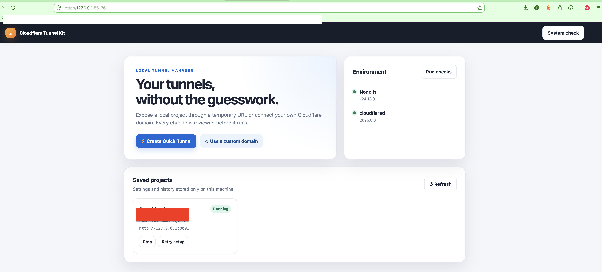

# cloudflare-tunnel-kit

An open-source toolkit for creating and integrating Cloudflare Tunnels through two simple interfaces: a command-line wizard and a local live UI. It replaces scattered shell scripts and Makefile targets with a validated, reviewable, and confirmation-based workflow.



## Current version

`0.1.0` is the current MVP and includes:

- A reusable TypeScript API for validation, plan generation, execution, and redaction.
- The `cf-tunnel` CLI with `init`, `create`, `quick`, `start`, `stop`, `status`, `doctor`, and `ui` commands.
- `custom` and `laravel` project profiles.
- Quick Tunnel and named-tunnel command generation.
- URL, hostname, tunnel-name, and project-path validation.
- Dry-run mode, structured errors, remediation guidance, and copyable AI help prompts.
- A lightweight localhost UI with live plan preview and confirmation-token protection.
- Laravel detection and `APP_URL` proposal/diff with explicit confirmation.

Laravel `.env` changes are never written silently. The current MVP presents the proposed diff and requires confirmation; automatic file mutation is intentionally not enabled yet.

## Design principles

The workflow is always:

```text
input -> detect -> validate -> preview plan -> confirm -> execute -> summary
```

The toolkit does not concatenate user input into shell commands, print secrets to logs, overwrite configuration silently, or send diagnostics to an external service.

## Requirements

- Node.js 20 or newer.
- `cloudflared` available in `PATH` when starting a real tunnel.
- Appropriate Cloudflare permissions for named tunnels.

## Installation

Install the package in the project that needs a tunnel:

```bash
npm install --save-dev cloudflare-tunnel-kit
```

The package exposes the `cf-tunnel` binary locally. Run it through `npx` so no global installation is required:

```bash
npx cf-tunnel
npx cf-tunnel ui
```

You can also add project scripts:

```json
{
  "scripts": {
    "tunnel": "cf-tunnel",
    "tunnel:ui": "cf-tunnel ui"
  }
}
```

Then run `npm run tunnel` or `npm run tunnel:ui`.

## CLI usage

Check the local environment:

```bash
npx cf-tunnel doctor
```

Run `npx cf-tunnel` without options to start the interactive text-only wizard. It asks for each value, validates before execution, prints a command preview, and asks for confirmation.

Preview a Quick Tunnel without starting `cloudflared`:

```bash
npx cf-tunnel quick --url http://127.0.0.1:8000 --dry-run
```

Preview a named tunnel:

```bash
npx cf-tunnel create \
  --url http://127.0.0.1:8000 \
  --name my-project \
  --hostname tunnel.example.com \
  --dry-run
```

Lifecycle commands:

```text
npx cf-tunnel start --name my-project
npx cf-tunnel stop --name my-project
npx cf-tunnel status --name my-project
```

`--yes` does not bypass validation or Laravel `.env` confirmation.

## Live UI

Start the local UI:

```bash
npx cf-tunnel ui
```

The command prints startup progress, chooses an available loopback port, and opens the browser automatically. If the browser cannot be opened, copy the printed `http://127.0.0.1:<port>` URL. Use `npx cf-tunnel ui --no-open` when you only want the URL.

The UI binds to loopback by default and does not send the copied prompt anywhere.

## Custom profile

The custom profile makes no framework assumptions:

```bash
npx cf-tunnel quick --profile custom --url http://127.0.0.1:3000 --dry-run
npx cf-tunnel create --profile custom --url http://127.0.0.1:8000 --name billing --hostname billing.example.com --dry-run
```

## Laravel profile

The Laravel adapter checks for `artisan` and Laravel evidence in `composer.json`. It can propose mappings such as `APP_URL`, `ASSET_URL`, and optional Reverb URLs.

Every mapping is shown as a diff and requires explicit confirmation. If `.env` is missing or ambiguous, the adapter stops with a remediation message instead of guessing.

```bash
npx cf-tunnel create \
  --profile laravel \
  --url http://127.0.0.1:8000 \
  --name law-firm \
  --hostname law.example.com \
  --dry-run
```

## API

```ts
import {
  validateTunnelConfig,
  createTunnelPlan,
  executeTunnelPlan,
} from 'cloudflare-tunnel-kit';

const config = {
  profile: 'custom',
  operation: 'quick',
  localUrl: 'http://127.0.0.1:8000',
};

const validation = validateTunnelConfig(config);
if (!validation.ok) {
  for (const error of validation.issues) {
    console.error(error.code, error.reason, error.fix);
  }
}

const plan = createTunnelPlan(config);
const result = await executeTunnelPlan(plan, { dryRun: true });
console.log(result);
```

Plans are serializable and can be displayed inside another system. Execute only validated plans and provide the required confirmation groups.

## Error model

Every error includes a stable `code`, optional `field`, `reason`, and `fix`. Common codes include:

- `INPUT_INVALID_URL`: the local URL is not HTTP/HTTPS.
- `INPUT_INVALID_HOSTNAME`: the hostname is not valid.
- `INPUT_INVALID_TUNNEL_NAME`: the tunnel name is unsafe.
- `PATH_OUTSIDE_PROJECT`: the config path escapes the project root.
- `CONFIRMATION_REQUIRED`: a mutation has not been confirmed.
- `PROCESS_FAILED`: `cloudflared` failed or could not be started.

Review the redacted prompt before pasting it into an external AI service.

## Security model

- The UI binds to `127.0.0.1` by default.
- Child processes use argv arrays with shell execution disabled.
- Secret-looking keys/values, bearer tokens, and credential paths are redacted.
- File paths are checked against the project root.
- Dry-run does not start `cloudflared`.
- Configuration overwrite and Laravel `.env` changes require a visible plan and confirmation.
- No telemetry or diagnostics are sent externally.

This toolkit does not replace review of Cloudflare account permissions, DNS, access policies, or organizational secret management.

## Publishing to npm

After logging in to npm and completing any required 2FA verification:

```bash
npm install
npm run build
npm test
npm pack --dry-run
npm publish
```

Increase the version before publishing a new release:

```bash
npm version patch
npm publish
```

An already-published `name@version` cannot be published again. See the [npm publish documentation](https://docs.npmjs.com/cli/commands/npm-publish/).

## Development

These commands are only for contributors working from a source checkout. Projects that install the npm package do not need this repository's Makefile.

```bash
npm install
npm test
npm run build
git diff --check
```

Tests use Node built-ins and temporary fixtures; no Cloudflare account is required. Add tests before introducing new behavior, do not place real secrets in fixtures, and keep remediation messages actionable.

## License

MIT. See [LICENSE](LICENSE).
