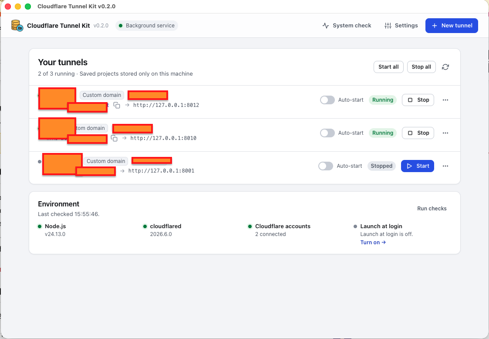

# cloudflare-tunnel-kit

An open-source toolkit for creating and integrating Cloudflare Tunnels through three interfaces: a menu bar app with a native window, a local dashboard in the browser, and a command-line wizard. Tunnels run in a background service, so they keep running after the terminal closes. It replaces scattered shell scripts and Makefile targets with a validated, reviewable, and confirmation-based workflow.



## Current version

`0.2.0` adds:

- `cftunnel` with no arguments asks whether to open the menu bar app, the browser dashboard, or the terminal wizard.
- A background service that owns every connector, restores auto-start projects, and restarts crashed connectors with backoff.
- A menu bar app (Electron, downloaded on first use) with per-project controls, notifications, and a native settings window.
- Launch at login on macOS (launchd), with stale-path detection and repair.
- Multiple Cloudflare accounts: import existing `~/.cloudflared/cert.pem*` files or sign in without replacing `~/.cloudflared/cert.pem`; each project uses its own account.
- A Settings panel and `cftunnel settings` for tray, port, restart, cloudflared, notification, and update options.
- Update checks for cftunnel and cloudflared, with one-click install and service restart for global npm installs.
- Fixed: ingress validation now actually runs (`cloudflared tunnel --config <file> ingress validate`); every UI route rejects non-loopback Host headers.

Behavior changes from 0.1.x:

- `cftunnel ui` starts the background service and returns; use `cftunnel ui --foreground` for the previous terminal-bound UI.
- `cftunnel` with no arguments shows the launcher; `cftunnel init` opens the terminal wizard directly.
- A custom-domain setup no longer runs `cloudflared tunnel login` on its own; connect accounts with `cftunnel account` or Settings → Accounts.
- The local database is migrated to schema version 2 on first start; a `state.db.pre-migration-backup` copy is kept.

Also included since 0.1.x:

- A reusable TypeScript API for validation, plan generation, execution, and redaction.
- The `cf-tunnel` CLI with `init`, `create`, `quick`, `start`, `stop`, `status`, `doctor`, and `ui` commands.
- `custom` and `laravel` project profiles.
- Quick Tunnel and named-tunnel command generation.
- URL, hostname, tunnel-name, and project-path validation.
- Dry-run mode, structured errors, remediation guidance, and copyable AI help prompts.
- A lightweight localhost UI with live plan preview and confirmation-token protection.
- Laravel detection and `APP_URL` proposal/diff with explicit confirmation.

Laravel `.env` changes are never written silently. The current MVP presents the proposed diff and requires confirmation; automatic file mutation is intentionally not enabled yet.

## Design principles

The workflow is always:

```text
input -> detect -> validate -> preview plan -> confirm -> execute -> summary
```

The toolkit does not concatenate user input into shell commands, print secrets to logs, overwrite configuration silently, or send diagnostics to an external service.

## Requirements

- Node.js 20 or newer.
- `cloudflared` available in `PATH` (or set `cloudflaredPath`) when starting a real tunnel.
- Appropriate Cloudflare permissions for named tunnels.
- Optional: about 100 MB of disk for the menu bar app's Electron runtime, installed on first `cftunnel tray`.
- Launch at login currently requires macOS.

## Installation

Install the package in the project that needs a tunnel:

```bash
npm install --save-dev cloudflare-tunnel-kit
```

For a machine-wide command available from any directory, install it globally:

```bash
npm install --global cloudflare-tunnel-kit
```

Then use either command name:

```bash
cf-tunnel doctor
cftunnel ui
```

Both commands use the same local application data directory and can be run from any project folder. The global install provides the CLI; `cloudflared` is still a separate prerequisite.

The package exposes the `cf-tunnel` binary locally. Run it through `npx` so no global installation is required:

```bash
npx cf-tunnel
npx cf-tunnel ui
```

You can also add project scripts:

```json
{
  "scripts": {
    "tunnel": "cf-tunnel",
    "tunnel:ui": "cf-tunnel ui"
  }
}
```

Then run `npm run tunnel` or `npm run tunnel:ui`.

## CLI usage

Check the local environment:

```bash
npx cf-tunnel doctor
```

Run `cftunnel` without options to choose how to open the toolkit:

```text
  1. Open the app (menu bar icon + window)
  2. Open the dashboard in your browser
  3. Use the terminal wizard
```

Press Enter for the app. Every choice starts the background service if it is not running yet. `cftunnel init` goes straight to the terminal wizard, which asks for each value, validates before execution, prints a command preview, and asks for confirmation.

Preview a Quick Tunnel without starting `cloudflared`:

```bash
npx cf-tunnel quick --url http://127.0.0.1:8000 --dry-run
```

Preview a named tunnel:

```bash
npx cf-tunnel create \
  --url http://127.0.0.1:8000 \
  --name my-project \
  --hostname tunnel.example.com \
  --dry-run
```

Lifecycle commands take the project id shown by `status`, the dashboard, or the wizard's saved-project list:

```text
npx cf-tunnel start --project <id>
npx cf-tunnel stop --project <id>
npx cf-tunnel restart --project <id>
npx cf-tunnel status --project <id>
```

These are sent to the background service when it is running, so the connector does not stop when the command exits.

`--yes` does not bypass validation or Laravel `.env` confirmation.

## Live UI

Start the local UI:

```bash
npx cf-tunnel ui
```

The command starts the background service if needed, then opens the menu bar app's window when the desktop runtime is installed, or the browser otherwise (`--browser` forces the browser). If the browser cannot be opened, copy the printed `http://127.0.0.1:<port>` URL. Use `npx cf-tunnel ui --no-open` when you only want the URL. To use a fixed port, pass `--port 8787` when the service starts; when omitted, `CLOUDFLARE_TUNNEL_KIT_UI_PORT`, then the `uiPort` setting is used, otherwise an available port is selected. Ports are always bound to `127.0.0.1`.

The UI binds to loopback by default and does not send the copied prompt anywhere.

## Background service and menu bar app

`cftunnel ui` starts a background service and returns. Tunnels keep running after the terminal closes; the dashboard talks to that service.

```bash
cftunnel ui                 # start the service if needed, open the window (or browser)
cftunnel tray               # first run downloads the Electron runtime (~100 MB) into the app data folder
cftunnel daemon status      # running?, URL, pid, log folder
cftunnel daemon stop        # stops the service and every running tunnel
cftunnel ui --foreground    # the old behaviour: UI tied to this terminal
```

The menu bar icon (filled when tunnels are running) lists every project with Start/Stop/Restart, Copy/Open public URL, Start all/Stop all, Launch at login, update status, and two quit options: quit only the menu bar app (tunnels keep running) or quit and stop all tunnels. Closing the window hides it. The tray never opens the database; it uses the service's loopback API.

Lifecycle commands (`start`, `stop`, `restart`, `status`, `create --yes`, `quick --yes`) are sent to the running service, so connectors are not tied to your shell.

Crashed connectors restart automatically after 5s, 15s, 60s, 2m, then 5m, up to `maxRestartAttempts`. A desktop notification is shown when a connector drops or a Quick Tunnel gets a new URL.

## Launch at login (macOS)

```bash
cftunnel autostart enable   # writes ~/Library/LaunchAgents/vn.cftunnel.daemon.plist and loads it
cftunnel autostart status   # reports "stale" if the recorded node/cftunnel path no longer exists
cftunnel autostart disable
```

The agent records absolute paths to the current `node` and `cftunnel`, and a PATH that includes the folder containing `cloudflared` plus `/opt/homebrew/bin` and `/usr/local/bin`. After switching Node versions with nvm/fnm, run `cftunnel autostart enable` again (or press **Repair** in Settings). Projects with **Start with the service** turned on are started when the service launches. Windows and Linux are not supported yet.

## Cloudflare accounts

Each Cloudflare account is one origin certificate stored in the app data folder (`accounts/<id>/cert.pem`, mode 600). Every Cloudflare command runs with `--origincert` for the project's account, and new tunnel credentials are stored next to that certificate.

```bash
cftunnel account discover            # lists ~/.cloudflared/cert.pem* (for example cert.pem.work)
cftunnel account import --all        # copies them; the originals are not changed
cftunnel account login --label work  # signs in with an isolated HOME, so ~/.cloudflared/cert.pem is never replaced
cftunnel account list
cftunnel account default <id>
cftunnel create --account <id> --url http://127.0.0.1:8000 --name shop --hostname shop.example.com --yes
```

A tunnel lives in one account. Changing a project's account in the dashboard creates a new tunnel and DNS route in the new account the next time it starts, after a confirmation. Tunnels created before multi-account support are linked to an imported account automatically using the `AccountTag` in their credentials file; otherwise they keep using `~/.cloudflared/cert.pem`.

A custom-domain setup no longer signs in to Cloudflare on its own. If the account is missing or expired, it stops with `AUTH_REQUIRED`/`AUTH_STALE` and the dashboard offers **Sign in again** for that account.

## Settings

Open **Settings** in the dashboard or use `cftunnel settings get` / `cftunnel settings set KEY VALUE`. Available keys: `trayEnabled`, `openWindowOnLaunch`, `showDockIcon`, `uiPort`, `restoreTunnelsOnLaunch`, `autoRestartOnCrash`, `maxRestartAttempts`, `cloudflaredPath`, `protocol` (`auto|quic|http2`), `noAutoupdate`, `logLevel`, `notifyOnDisconnect`, `notifyOnQuickUrl`, `checkForUpdates`, `autoInstallUpdates`, `updateCheckIntervalHours`, `defaultAccountId`.

## Updates

The background service checks the public npm registry and the cloudflared GitHub releases once a day (`checkForUpdates`, opt-out). Nothing about your machine is sent.

```bash
cftunnel update --check
cftunnel update             # global installs only: installs, verifies `cftunnel --version`, then restarts the service
```

For a global install, **Install update and restart** in the menu bar or Settings installs the new version, checks that the new CLI runs, then restarts the service and resumes the tunnels that were running (a few seconds of downtime). If any step fails, the running service is left untouched. Set `autoInstallUpdates` to do this without asking. Project-local installs only show the command to run. cloudflared is never updated automatically; when a newer release exists the dashboard shows `brew upgrade cloudflared` (Homebrew) or the download link.

## Custom profile

The custom profile makes no framework assumptions:

```bash
npx cf-tunnel quick --profile custom --url http://127.0.0.1:3000 --dry-run
npx cf-tunnel create --profile custom --url http://127.0.0.1:8000 --name billing --hostname billing.example.com --dry-run
```

## Laravel profile

The Laravel adapter checks for `artisan` and Laravel evidence in `composer.json`. It can propose mappings such as `APP_URL`, `ASSET_URL`, and optional Reverb URLs.

Every mapping is shown as a diff and requires explicit confirmation. If `.env` is missing or ambiguous, the adapter stops with a remediation message instead of guessing.

```bash
npx cf-tunnel create \
  --profile laravel \
  --url http://127.0.0.1:8000 \
  --name law-firm \
  --hostname law.example.com \
  --dry-run
```

## API

```ts
import {
  validateTunnelConfig,
  createTunnelPlan,
  executeTunnelPlan,
} from 'cloudflare-tunnel-kit';

const config = {
  profile: 'custom',
  operation: 'quick',
  localUrl: 'http://127.0.0.1:8000',
};

const validation = validateTunnelConfig(config);
if (!validation.ok) {
  for (const error of validation.issues) {
    console.error(error.code, error.reason, error.fix);
  }
}

const plan = createTunnelPlan(config);
const result = await executeTunnelPlan(plan, { dryRun: true });
console.log(result);
```

Plans are serializable and can be displayed inside another system. Execute only validated plans and provide the required confirmation groups.

## Error model

Every error includes a stable `code`, optional `field`, `reason`, and `fix`. Common codes include:

- `INPUT_INVALID_URL`: the local URL is not HTTP/HTTPS.
- `INPUT_INVALID_HOSTNAME`: the hostname is not valid.
- `INPUT_INVALID_TUNNEL_NAME`: the tunnel name is unsafe.
- `PATH_OUTSIDE_PROJECT`: the config path escapes the project root.
- `CONFIRMATION_REQUIRED`: a mutation has not been confirmed.
- `PROCESS_FAILED`: `cloudflared` failed or could not be started.

Review the redacted prompt before pasting it into an external AI service.

## Security model

- The UI binds to `127.0.0.1` by default, and every request must carry a `127.0.0.1`/`localhost` Host header (DNS-rebinding protection for the long-running service).
- The service writes `daemon.json` (port and session token, mode 600) in the app data folder for the CLI and tray.
- Child processes use argv arrays with shell execution disabled.
- Secret-looking keys/values, bearer tokens, and credential paths are redacted.
- File paths are checked against the project root.
- Dry-run does not start `cloudflared`.
- Configuration overwrite and Laravel `.env` changes require a visible plan and confirmation.
- No telemetry or diagnostics are sent externally. The only outbound requests are the optional update checks described above.

This toolkit does not replace review of Cloudflare account permissions, DNS, access policies, or organizational secret management.

## Publishing to npm

After logging in to npm and completing any required 2FA verification:

```bash
npm install
npm run build
npm test
npm pack --dry-run
npm publish
```

Increase the version before publishing a new release:

```bash
npm version patch
npm publish
```

An already-published `name@version` cannot be published again. See the [npm publish documentation](https://docs.npmjs.com/cli/commands/npm-publish/).

## Development

These commands are only for contributors working from a source checkout. Projects that install the npm package do not need this repository's Makefile.

```bash
npm install
npm test
npm run build
git diff --check
```

Tests use Node built-ins and temporary fixtures; no Cloudflare account is required. Add tests before introducing new behavior, do not place real secrets in fixtures, and keep remediation messages actionable.

## License

MIT. See [LICENSE](LICENSE).
